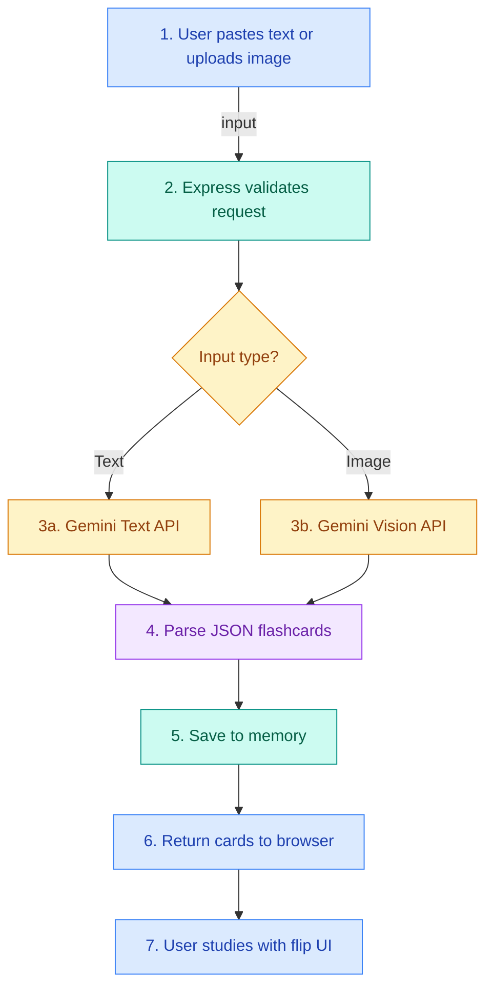
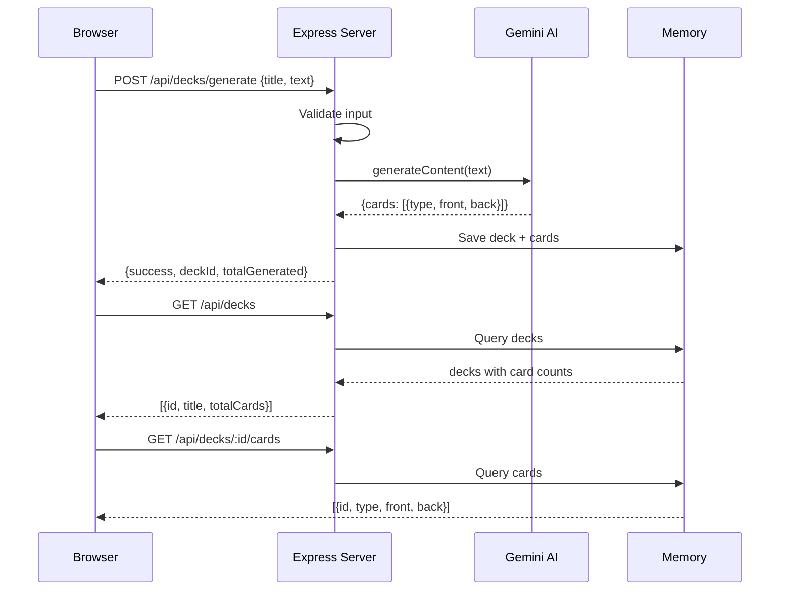
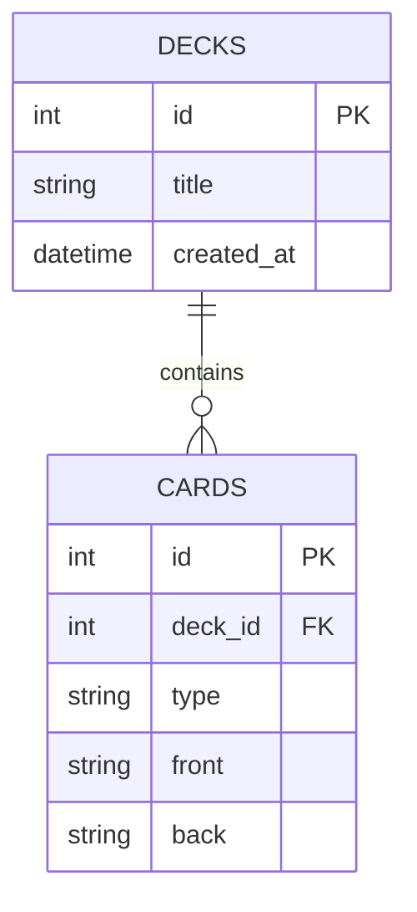

# FlashMind

> Turn any text or image into study flashcards — instantly.

**Live app:** https://ai-flashcard-generator-nine.vercel.app

---

## What it does

- Paste text (notes, textbooks, manuals) or upload a photo
- AI automatically creates question-and-answer flashcards
- Study with a smooth flip-card interface
- Rate difficulty to track what you know

---

## How it works


### Step-by-step flow



---

## API Request Flow



---

## Tech Stack

| Layer | Technology | Purpose |
|-------|-----------|---------|
| Frontend | HTML, Tailwind CSS, JS | UI and interactions |
| Backend | Express.js v5 | API server |
| Uploads | Multer | File handling (images) |
| AI | Gemini 2.5 Flash | Text + Vision generation |
| Hosting | Vercel | Serverless deployment |
| VCS | GitHub | Source code |

---

## Data Model



---

## Flashcard Types

| Type | Front | Back |
|------|-------|------|
| **QA** | What is the closest planet to the Sun? | Mercury |
| **CLOZE** | The ______ is the hottest planet. | Venus |

---

## Deployment Pipeline

```mermaid
graph LR
    A["git push"] --> B["GitHub"]
    B --> C["Vercel Build"]
    C --> D["Serverless Function"]
    D --> E["Express.js"]
    E --> F["Gemini API"]
    F --> G["Live App"]
    style A fill:#dbeafe,stroke:#3b82f6,color:#1e40af
    style B fill:#f1f5f9,stroke:#64748b,color:#334155
    style C fill:#f3e8ff,stroke:#9333ea,color:#6b21a8
    style D fill:#f3e8ff,stroke:#9333ea,color:#6b21a8
    style E fill:#ccfbf1,stroke:#0d9488,color:#065f46
    style F fill:#fef3c7,stroke:#d97706,color:#92400e
    style G fill:#ccfbf1,stroke:#0d9488,color:#065f46
```



---

## Quick Start

```bash
npm install
```

Create `.env`:

```
GEMINI_API_KEY=your_key_here
```

Run:

```bash
node server.js
```

Open http://localhost:3000.

---

## Deploy to Vercel

1. Push to GitHub
2. Import repo on vercel.com
3. Add `GEMINI_API_KEY` as environment variable
4. Deploy

> **Note:** Vercel uses in-memory storage. Data resets on cold starts. For persistence, use Turso or Vercel Postgres.

---

## Project Structure

```
├── index.html          # Frontend (HTML + CSS + JS)
├── server.js           # Backend (Express + AI + storage)
├── package.json        # Dependencies
├── vercel.json         # Vercel config
├── PRESENTATION.html   # Visual presentation (open in browser)
├── .env                # API keys (not in git)
└── README.md           # This file
```

---

## Future Improvements

- Spaced repetition (SM-2 algorithm)
- Cloud database (Turso / Vercel Postgres)
- PDF support
- User accounts & auth
- Export to Anki (.apkg)
- Dark mode
- Mobile app (PWA)

---

**Made with by FlashMind**
